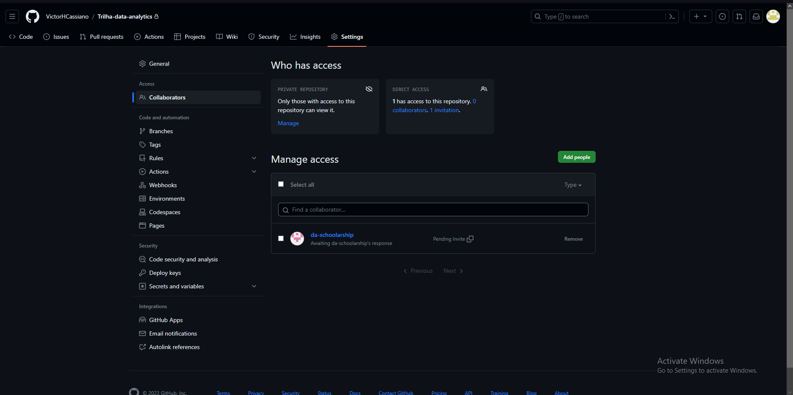

## Exercicio 1
#####Criar um repositório (privado) para armazenar anotações e códigos criados ao longo do Programa de Bolsas no GitHub(em sua própria conta pessoal). Adicione como colaborador do repositório o usuário da-schoolarship.

